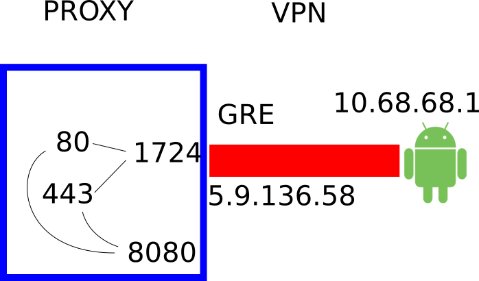
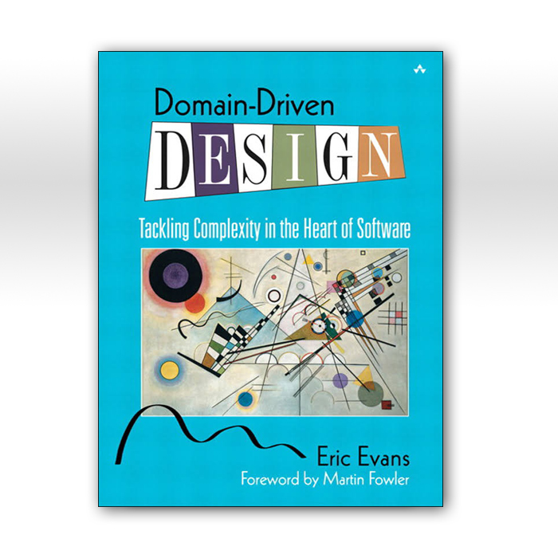
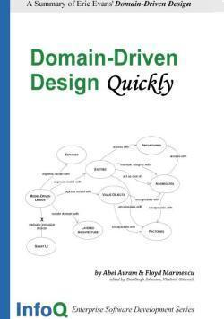

@title[Introduction]

#### Alex <span class="gold">Madon</span>
#### capturing Android SSL traffic
#### 2017/11/16

---

@title[SSL]


---

@title[On Desktop]

###  <span class="gold">On Desktop</span>
###  wireshark + private key
###  wireshark + SSLKEYLOGFILE

---

@title[On Android: iptables+mitmproxy -T+pptpd]


### On Android: iptables+mitmproxy -T+pptpd



---

@title[On Android]


---

@title[Introduction]

# Git<span class="gold">Pitch</span>

#### Markdown Presentations For Everyone on Git.*
<br>
<br>
<span class="byline">[ GitHub, GitLab, Bitbucket, GitBucket, Gitea, Gogs ]</span>

---

@title[PITCHME.md]

#### GitPitch turns <span class="gold">PITCHME.md</span> into
#### interactive,
#### online and offline slideshows.
<br>
<span class="aside">Just like this one...</span>

---

#### No more <span class="gray">Keynote</span>.
#### No more <span class="gray">Powerpoint</span>.
<br>
#### Just <span class="gold">Markdown</span>.
#### Then <span class="gold">Git-Commit</span>.

---

@title[Step 1. PITCHME.md]

### <span class="gold">STEP 1. Create 'PITCHME.md'</span>
<br>
#### Create GitPitch slideshow content using GitHub Flavored Markdown in your favorite editor.
<br>
<span class="aside">It's as easy as README.md with simple slide-delimeters (---)</span>

---

@title[Step 2. Git-Commit]

### <span class="gold">STEP 2. GIT-COMMIT</span>
<br>

```shell
$ git add PITCHME.md
$ git commit -m "New slideshow content."
$ git push

Done!
```

@[1](Add your PITCHME.md slideshow content file.)
@[2](Commit PITCHME.md to your local repo.)
@[3](Push PITCHME.md to your public repo and you're done!)
@[5](Supports GitHub, GitLab, Bitbucket, GitBucket, Gitea, and Gogs.)

---

@title[Step 3. Done!]

### <span class="gold">STEP 3. GET THE WORD OUT!</span>
<br>

<br>
<br>
#### Instantly use your GitPitch slideshow URL to promote, pitch or present absolutely anything.

---

@title[Slide Rich]

### <span class="gold">Slide Rich</span>

#### Code Presenting for Blocks, Files, and GISTs
#### Image, Video, Chart, and Math Slides
#### Multiple Themes with Easy Customization
<br>
#### <span class="gold">Plus collaboration is built-in...</span>
#### Your Slideshow is Part of Your Project
#### Under Git Version Control within Your Git Repo

---

@title[Feature Rich]

### <span class="gold">Feature Rich</span>

#### Present Online or Offline
#### With Speaker Notes Support
#### Print Presentation as PDF
#### Auto-Generated Table-of-Contents
#### Share Presentation on Twitter or LinkedIn

---

### Go for it.
### Just add <span class="gold">PITCHME.md</span> ;)
<br>
[Click here to learn more...](https://github.com/gitpitch/gitpitch/wiki)


---

@title[Introduction]
## The Kitchen Sink
##### <span style="font-family:Helvetica Neue; font-weight:bold">A <span style="color:#e49436">Git</span>Pitch Feature Tour</span>

---
@title[Theme Switcher]

## Slideshow Theme Switcher
<span style="font-size:0.6em; color:gray">Available inside burger-menu.</span> |
<span style="font-size:0.6em; color:gray">Start switching themes right now!</span>

---
@title[Go Fullscreen]

## Tip!
For the *best viewing experience*   
press **F** key to go fullscreen.

---

## Markdown Slides
<span style="font-size:0.6em; color:gray">Press Down key for details.</span> |
<span style="font-size:0.6em; color:gray">See [GitPitch Wiki](https://github.com/gitpitch/gitpitch/wiki/Slide-Markdown) for details.</span>


+++
@title[GFM]

#### Use GitHub Flavored Markdown
#### For Slide Content Creation

<br>

The *same syntax* you use to create project   
**READMEs** and **Wikis** for your Git repos.

---

## Code Presenting
## Repo Source Files
<span style="font-size:0.6em; color:gray">Press Down key for examples.</span> |
<span style="font-size:0.6em; color:gray">See [GitPitch Wiki](https://github.com/gitpitch/gitpitch/wiki/Code-Presenting) for details.</span>


+++
@title[Present From Source]

#### Present Source Directly From Your Repo

<br>

Step through source code directly within your presentations.
*No more switching* back and forth between your slideshow and your IDE!

+++?code=src/elixir/monitor.ex&lang=elixir&title=Source: Elixir Snippets

@[11-14](Elixir module-attributes as constants)
@[22-28](Elixir with-statement for conciseness)
@[171-177](Elixir case-statement pattern matching)
@[179-185](Elixir pipe-mechanism for composing functions)=

---
@title[Present Static Block]

## Code Presenting
## Static Source Blocks
<span style="font-size:0.6em; color:gray">Press Down key for examples.</span> |
<span style="font-size:0.6em; color:gray">See [GitPitch Wiki](https://github.com/gitpitch/gitpitch/wiki/Code-Presenting) for details.</span>


+++
@title[Syntax Highlighting]
#### Present Source Embedded In Your Presentation Markdown

<br>

Enjoy code syntax highlighting for dozens of languages powered by [highlight.js](tlhttps://highlightjs.org).

+++
@title[Block: Python Snippets]

Static Code Block: Python Snippets

```python
from time import localtime

activities = {8: 'Sleeping', 9: 'Commuting', 17: 'Working',
              18: 'Commuting', 20: 'Eating', 22: 'Resting' }

time_now = localtime()
hour = time_now.tm_hour

for activity_time in sorted(activities.keys()):
    if hour < activity_time:
        print activities[activity_time]
        break
else:
    print 'Unknown, AFK or sleeping!'
```

@[1](Python from..import statement)
@[3-4](Python dictionary initialization block)
@[6-7](Python working with time)
@[9-14](Python for..else statement)

---
@title[Present GIST]

## Code Presenting
## GitHub GIST
<span style="font-size:0.6em; color:gray">Press Down key for examples.</span> |
<span style="font-size:0.6em; color:gray">See [GitPitch Wiki](https://github.com/gitpitch/gitpitch/wiki/Code-Presenting) for details.</span>


+++
@title[Directly from GitHub]

#### Present Source Directly From GitHub GIST

<br>

Step through GIST source code within    
*online and offline* presentations.

+++?gist=onetapbeyond/494e0fecaf0d6a2aa2acadfb8eb9d6e8&lang=Scala&title=GIST: Scala Snippets
@title[Sample GIST]

@[23](Initialize Apache Spark cluster execution context)
@[47-53](Transform RDD into set of AWS Lambda tasks)
@[62](Delegate execution off Spark cluster to AWS Lambda)
@[72-75](Handle AWS Lambda task execution results)

---
@title[Embed Images]

## Image Slides
## [ Inline ]
<span style="font-size:0.6em; color:gray">Press Down key for examples.</span> |
<span style="font-size:0.6em; color:gray">See [GitPitch Wiki](https://github.com/gitpitch/gitpitch/wiki/Image-Slides) for details.</span>


+++

#### Make A Visual Statement

<br>

Use inline images to lend   
a *visual punch* to your slideshow presentations.


+++
@title[Private Investocat]

<span style="color:gray; font-size:0.7em">Inline Image at <b>Absolute URL</b></span>


<span style="color:gray; font-size: 0.5em;">the <b>Private Investocat</b> by [jeejkang](https://github.com/jeejkang)</span>


+++
@title[Octocat De Los Muertos]

<span style="color:gray; font-size:0.7em">Inline Image at GitHub Repo <b>Relative URL</b></span>


<span style="color:gray; font-size:0.5em">the <b>Octocat-De-Los-Muertos</b> by [cameronmcefee](https://github.com/cameronmcefee)</span>


+++
@title[Daftpunktocat]

<span style="color:gray; font-size:0.7em"><b>Animated GIFs</b> Work Too!</span>


<span style="color:gray; font-size:0.5em">the <b>Daftpunktocat-Guy</b> by [jeejkang](https://github.com/jeejkang)</span>

---
@title[Background Images]

## Image Slides
## [ Background ]
<span style="font-size:0.6em; color:gray">Press Down key for examples.</span> |
<span style="font-size:0.6em; color:gray">See [GitPitch Wiki](https://github.com/gitpitch/gitpitch/wiki/Image-Slides#background) for details.</span>


+++
@title[Bold Statements]

#### Make A Bold Visual Statement

<br>

Use high-resolution background images   
for *maximum impact*.

+++?image=https://d1z75bzl1vljy2.cloudfront.net/kitchen-sink/victory.jpg
@title[V For Victory]

+++?image=https://d1z75bzl1vljy2.cloudfront.net/kitchen-sink/127.jpg
@title[127.0.0.1]

---
@title[Embed Video]
## Video Slides
## [ Inline ]
<span style="font-size:0.6em; color:gray">Press Down key for examples.</span> |
<span style="font-size:0.6em; color:gray">See [GitPitch Wiki](https://github.com/gitpitch/gitpitch/wiki/Video-Slides) for details.</span>


+++
@title[YouTube, etc]

#### Bring Your Presentations Alive

<br>

Embed *YouTube*, *Vimeo*, *MP4* and *WebM*   
inline on any slide.

+++
@title[Fresh Guacamole]


+++
@title[Gravity]


+++
@title[Big Buck Bunny]


---
@title[Background Videos]

## Video Slides
## [ Background ]
<span style="font-size:0.6em; color:gray">Press Down key for examples.</span> |
<span style="font-size:0.6em; color:gray">See [GitPitch Wiki](https://github.com/gitpitch/gitpitch/wiki/Video-Slides#background) for details.</span>


+++
@title[Viewer Experience]

#### Maximize The Viewer Experience

<br>

Go fullscreen with *MP4* and *WebM* videos.

+++?video=http://clips.vorwaerts-gmbh.de/big_buck_bunny.mp4
@title[Big Buck Bunny]

---

## Math Notation Slides
<span style="font-size:0.6em; color:gray">Press Down key for examples.</span> |
<span style="font-size:0.6em; color:gray">See [GitPitch Wiki](https://github.com/gitpitch/gitpitch/wiki/Math-Notation-Slides) for details.</span>


+++
@title[Beautiful Math]

#### Beautiful Math Rendered Beautifully

<br>

Use *TeX*, *LaTeX* and *MathML* markup   
powered by [MathJax](https://www.mathjax.org).

+++
@title[Sample]

`$$\sum_{i=0}^n i^2 = \frac{(n^2+n)(2n+1)}{6}$$`

+++
@title[Sample]

`\begin{align}
\dot{x} & = \sigma(y-x) \\
\dot{y} & = \rho x - y - xz \\
\dot{z} & = -\beta z + xy
\end{align}`

+++
@title[Sample]

##### The Cauchy-Schwarz Inequality

`\[
\left( \sum_{k=1}^n a_k b_k \right)^{\!\!2} \leq
 \left( \sum_{k=1}^n a_k^2 \right) \left( \sum_{k=1}^n b_k^2 \right)
\]`

+++
@title[Inline Sample]

##### In-line Mathematics

This expression `\(\sqrt{3x-1}+(1+x)^2\)` is an example of an inline equation.

---

## Chart Slides
<span style="font-size:0.6em; color:gray">Press Down key for examples.</span> |
<span style="font-size:0.6em; color:gray">See [GitPitch Wiki](https://github.com/gitpitch/gitpitch/wiki/Chart-Slides) for details.</span>


+++
@title[Chart Types]

#### Chart Data Rendered Beautifully

<br>

Use *Bar*, *Line*, *Area*, and *Scatter* charts among many other chart types directly within your markdown, all powered by [Chart.js](http://www.chartjs.org).

+++
@title[Sample Line Chart]

<canvas data-chart="line">
<!--
{
 "data": {
  "labels": ["January"," February"," March"," April"," May"," June"," July"],
  "datasets": [
   {
    "data":[65,59,80,81,56,55,40],
    "label":"My first dataset","backgroundColor":"rgba(20,220,220,.8)"
   },
   {
    "data":[28,48,40,19,86,27,90],
    "label":"My second dataset","backgroundColor":"rgba(220,120,120,.8)"
   }
  ]
 },
 "options": { "responsive": "true" }
}
-->
</canvas>

+++
@title[Sample Bar Chart]

<canvas class="stretch" data-chart="horizontalBar">
<!--
{
 "data" : {
  "labels" : ["Grapefruit", "Orange", "Kiwi",
    "Blackberry", "Banana",
    "Blueberry"],
  "datasets" : [{
    "data": [48, 26, 59, 39, 21, 74],
    "backgroundColor": "#e49436",
    "borderColor": "#e49436"
  }]
  },
  "options": {
    "title": {
      "display": true,
      "text": "The most delicious fruit?",
      "fontColor": "gray",
      "fontSize": 20
    },
    "legend": {
      "display": false
    },
    "scales": {
      "xAxes": [{
        "ticks": {
            "beginAtZero": true,
            "max": 80,
            "stepSize": 10,
            "fontColor": "gray"
        },
        "scaleLabel": {
          "display": true,
          "labelString": "Respondents",
          "fontColor": "gray"
        }
      }],
      "yAxes": [{
        "ticks": {
            "fontColor": "gray"
        }
      }]
    }
  }
}
-->
</canvas>

---

## Slide Fragments
<span style="font-size:0.6em; color:gray">Press Down key for examples.</span> |
<span style="font-size:0.6em; color:gray">See [GitPitch Wiki](https://github.com/gitpitch/gitpitch/wiki/Fragment-Slides) for details.</span>


+++

#### Reveal Slide Concepts Piecemeal
@title[Piecemeal Concepts]

<br>

Step through slide content in sequence   
to *slowly reveal* the bigger picture.

+++
@title[Piecemeal Lists]

- Java
- Groovy |
- Kotlin |
- Scala  |
- The JVM rocks! |

+++
@title[Piecemeal Tables]

<table>
  <tr>
    <th>Firstname</th>
    <th>Lastname</th> 
    <th>Age</th>
  </tr>
  <tr>
    <td>Jill</td>
    <td>Smith</td>
    <td>25</td>
  </tr>
  <tr class="fragment">
    <td>Eve</td>
    <td>Jackson</td>
    <td>94</td>
  </tr>
  <tr class="fragment">
    <td>John</td>
    <td>Doe</td>
    <td>43</td>
  </tr>
</table>

---
## <span style="text-transform: none">PITCHME.yaml</span> Settings
<span style="font-size:0.6em; color:gray">Press Down key for examples.</span> |
<span style="font-size:0.6em; color:gray">See [GitPitch Wiki](https://github.com/gitpitch/gitpitch/wiki/Slideshow-Settings) for details.</span>


+++
@title[Custom Look and Feel]

#### Stamp Your Own Look and Feel

<br>

Set a default theme, custom logo, custom css, background image, and preferred code syntax highlighting style.

+++
@title[Custom Behavior]

#### Customize Slideshow Behavior

<br>

Enable auto-slide with custom slide intervals, presentation looping, and RTL flow.


---
@title[Keyboard Controls]
## Slideshow Keyboard Controls
<span style="font-size:0.6em; color:gray">Press Down key for examples.</span> |
<span style="font-size:0.6em; color:gray">See [GitPitch Wiki](https://github.com/gitpitch/gitpitch/wiki/Slideshow-Fullscreen-Mode) for details.</span>


+++
@title[Try Out Now!]

#### Try Out These Great Features Now!

<br>

| Mode | On Key | Off Key |
| ---- | :------: | :--------: |
| Fullscreen | F |  Esc |
| Overview | O |  O |
| Blackout | B |  B |
| Help | ? |  Esc |


---

## GitPitch Social
<span style="font-size:0.6em; color:gray">Press Down key for examples.</span> |
<span style="font-size:0.6em; color:gray">See [GitPitch Wiki](https://github.com/gitpitch/gitpitch/wiki/Slideshow-GitHub-Badge) for details.</span>


+++
@title[Designed For Sharing]

#### Slideshows Designed For Sharing

<br>

- View any slideshow at its public URL
- [Promote](https://github.com/gitpitch/gitpitch/wiki/Slideshow-GitHub-Badge) any slideshow using a GitHub badge
- [Embed](https://github.com/gitpitch/gitpitch/wiki/Slideshow-Embedding) any slideshow within a blog or website
- [Share](https://github.com/gitpitch/gitpitch/wiki/Slideshow-Sharing) any slideshow on Twitter, LinkedIn, etc
- [Print](https://github.com/gitpitch/gitpitch/wiki/Slideshow-Printing) any slideshow as a PDF document
- [Download and present](https://github.com/gitpitch/gitpitch/wiki/Slideshow-Offline) any slideshow offline

---
@title[Get The Word Out!]

## GO FOR IT.
## JUST ADD <span style="color:#e49436; text-transform: none">PITCHME.md</span> ;)

---

## Well-Designed Phoenix Applications

---

GitHub
<br>
@jeffcole

Twitter
<br>
@obscurehobo

---

### What does it mean <br> for an application <br> to be "well-designed?"

---

> From a practical point of view, changeability is the only design metric that matters; code that’s easy to change *is* well-designed.

> **Sandi Metz**

---

#### How do Elixir and Phoenix help us to write <br> easy-to-change applications?

---

#### How can we help ourselves <br> to write easy-to-change <br> Elixir and Phoenix applications?

---

### How do Elixir and Phoenix help?

---

### Controllers

---

```elixir
def create(conn, %{"post" => post_params}) do
  changeset = Post.changeset(post_params)

  case Repo.insert(changeset) do
    {:ok, post} ->
      conn
      |> put_flash(:info, "Post created successfully.")
      |> redirect(to: post_path(conn, :show, post))
    {:error, changeset} ->
      render(conn, "new.html", changeset: changeset)
  end
end
```

@[2, 4]

---

### Ecto

> A database wrapper and <br> integrated query language for Elixir

https://hex.pm/packages/ecto

---

#### Schemas

---

```elixir
use Ecto.Schema

schema "posts" do
  field :title, :string
  field :body, :text
  field :published, :boolean, default: false

  timestamps()
end
```

---

#### You can have *n* schemas per table

---

#### Schemas are data mappers

- From the database to application code |
- From user input to application code |
- From application code to the database |

---

#### Changesets

---

```elixir
import Ecto.Changeset

def changeset(%Post{} = post, attrs) do
  post
  |> cast(attrs, [:title, :published])
  |> validate_required([:title, :published])
end
```

---

#### You can have *n* changesets, <br> one for each use case

---

#### Changesets transform and validate data
- User input into a database schema |
- User input into a form schema... |
  - then into multiple database schemas |
- API responses into schemas |

---

#### Repos

---

```elixir
alias MyApp.{Post, Repo}

Repo.all(Post)

Repo.get!(Post, id)

Repo.insert(changeset)

Repo.update(changeset)

Repo.delete(post)
```

---

#### You interact with your app's repository <br> via its `Repo`

---

#### If you don't see `Repo`, <br> there's no repository interaction happening

---

#### Queries

---

```elixir
import Ecto.Query, only: [from: 2]

from p in Post,
  join: c in Comment, where: c.post_id == p.id
```

---

#### Queries are compiled

Query bugs are surfaced earlier

---

### Ecto Recap

- `Schema`
- `Changeset`
- `Repo`
- `Query`

---

#### Ecto provides a few layers of data abstraction

---

### Back to our controller

---

```elixir
def create(conn, %{"post" => post_params}) do
  changeset =
    Post.changeset(post_params) # Schema and Changeset layers

  case Repo.insert(changeset) do # Repo layer
    {:ok, post} ->
      conn
      |> put_flash(:info, "Post created successfully.")
      |> redirect(to: post_path(conn, :show, post))
    {:error, changeset} ->
      render(conn, "new.html", changeset: changeset)
  end
end
```

@[2-3, 5]

---

#### It's clear which layer you're interacting with

---

### Phoenix 1.3 Contexts

---

#### Contexts are a convention for <br> helping you to design the interactions <br> amongst your data

---

#### Generators

```shell
$ mix phx.gen.html Content Post posts title:string:unique
```

---

```elixir
defmodule MyApp.Content
  def list_posts do # Calls into Repo

  def get_post!(id) do # Calls into Repo

  def create_post(attrs \\ %{}) do # Calls into Repo

  def update_post(%Post{} = post, attrs) do # Calls into Repo

  def delete_post(%Post{} = post) do # Calls into Repo

  def change_post(%Post{} = post) do # Returns a changeset
end
```

@[2]
@[4]
@[6]
@[8]
@[10]
@[12]

---

#### Our controller without a context...

---

```elixir
def create(conn, %{"post" => post_params}) do
  changeset = Post.changeset(post_params)

  case Repo.insert(changeset) do
    {:ok, post} ->
      conn
      |> put_flash(:info, "Post created successfully.")
      |> redirect(to: post_path(conn, :show, post))
    {:error, changeset} ->
      render(conn, "new.html", changeset: changeset)
  end
end
```

@[2, 4]

---

#### With a context, becomes...

---

```elixir
def create(conn, %{"post" => post_params}) do
  case Content.create_post(post_params) do
    {:ok, post} ->
      conn
      |> put_flash(:info, "Post created successfully.")
      |> redirect(to: post_path(conn, :show, post))
    {:error, %Ecto.Changeset{} = changeset} ->
      render(conn, "new.html", changeset: changeset)
  end
end
```

@[2]

---

### Phoenix 1.3 Directory Structure

---

```text
lib
├── my_app
│   └── content
│       ├── content.ex
│       └── post.ex
└── my_app_web
    ├── channels
    ├── controllers
    ├── templates
    └── views
```

@[1]
@[2]
@[3]
@[4]
@[5]
@[2, 6]
@[2, 6-10]

---

### How do these features promote ease-of-change?

---

#### How do Elixir and Phoenix promote <br> ease-of-change?

- Each concept has it's place |
- Code is easy to find |
- Code is declarative |
- It's clear when side-effects are happening |
- Only what we need is provided |

---

### How can we help ourselves?

---

#### Alias all module references to a single atom, <br> and pull them up to the top of each file

---

#### Don't do this

```elixir
def list_posts do
  MyApp.Repo.all(MyApp.Content.Post)
end

# ...
```

---

#### Do this

```elixir
alias MyApp.Repo
alias MyApp.Content.Post

def list_posts do
  Repo.all(Post)
end

# ...
```

---

#### Break up context modules

---

```text
my_app
└── content
    ├── content.ex
    └── post.ex
```

---

```text
my_app
└── content
    ├── content.ex      # Context module
    └── post.ex
```

---

```text
my_app
└── content
    ├── comment.ex
    ├── content.ex      # Context module
    └── post.ex
```

---

```text
my_app
└── content
    ├── author.ex
    ├── comment.ex
    ├── content.ex      # Context module
    └── post.ex
```

---

```text
my_app
└── content
    ├── author.ex
    ├── comment.ex
    ├── content.ex      # Context module
    ├── post.ex
    └── subscription.ex
```

---

```text
my_app
└── content
    ├── author.ex
    ├── comment.ex
    ├── content.ex      # Context module
    ├── post.ex
    ├── subscription.ex
    └── tag.ex
```

---

```elixir
defmodule MyApp.Content
  def list_posts do

  def get_post!(id) do

  def create_post(attrs \\ %{}) do

  def update_post(%Post{} = post, attrs) do

  def delete_post(%Post{} = post) do

  def change_post(%Post{} = post) do

  # All of the above times four...
end
```

@[14]

---

#### A schema can be thought of as a sub-context

---

#### Ecto modules make decent boundary points across schemas

---

```text
my_app
└── content
    ├── comment.ex
    ├── content.ex
    └── post.ex
```

@[3, 5]

---

```text
my_app
└── content
    └── comment
        ├── changeset.ex
        ├── comment.ex   # Schema sub-context module
        ├── query.ex
        ├── repo.ex
        └── schema.ex
    ├── content.ex
    └── post
        ├── ...
```

@[3-8, 10-11]
@[5]

---

#### Sub-contexts need not be persisted entities

---

```text
my_app
└── content
    └── comment
        ├── ...
    ├── content.ex
    └── post
        ├── ...
    └── post_form
        ├── changeset.ex
        ├── post_form.ex # Sub-context module
        └── schema.ex
```

@[3-4, 6-7]
@[8]
@[8-11]

---

#### Don't get carried away

---

### Where did these new ideas come from?

---

### Where did these ~~new~~ ideas come from?

---



---

### Domain Driven Design

Eric Evans

- Layered Architecture |
- Entities |
- Modules |
- Repositories |
- Making Implicit Concepts Explicit |
- Side-Effect-Free Functions |
- Declarative Design |
- Refactoring Toward Deeper Insight |
- Bounded Context |
- Minimalism |

---



https://www.infoq.com/minibooks/domain-driven-design-quickly

---

Questions?

---

Thank you
